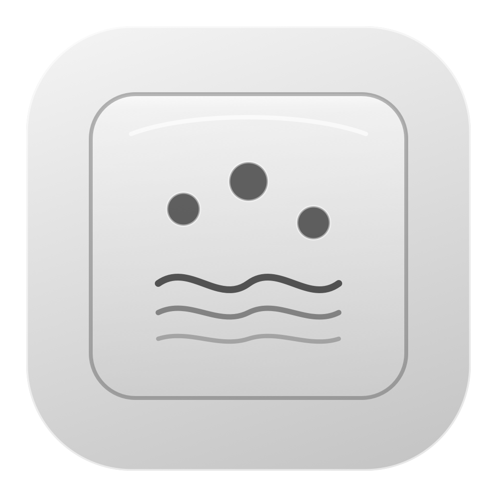
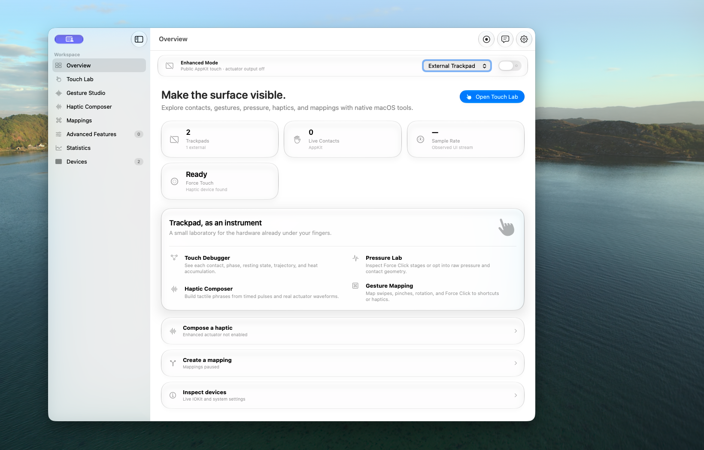
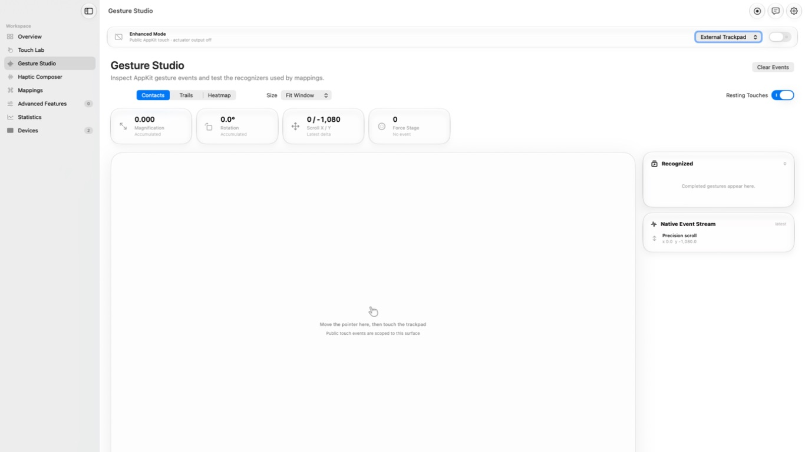

  

<h1 align="center">Trackpad Wizard</h1>

  A native macOS laboratory for touch, gestures, pressure, haptics, mappings, and trackpad hardware.

  
  
  
  

Trackpad Wizard explores the built-in trackpad and external Magic Trackpads through a native SwiftUI interface. Public AppKit behavior remains the default; capabilities Apple does not expose publicly live behind a clearly separated, session-only Enhanced Mode.

The app targets macOS 26 or later and follows current macOS window, sidebar, Liquid Glass, semantic-color, and typography conventions. The interface keeps decoration restrained so live data and controls remain easy to read.

## Screenshots

*Overview in a standard window on a clean macOS desktop.*

*Gesture Studio in full screen with a precision-scroll sample in the native event stream.*

## Highlights

- **Touch Lab** — inspect live contacts, resting touches, stable contact labels, trails, heatmaps, display-calibrated physical sizing, sample-rate estimates, Force Click pressure, and JSON session exports. A separate preview window can be resized or taken full screen.
- **Gesture Studio** — observe magnification, rotation, precision scrolling, swipes, pressure stages, gesture lifecycles, and derived three-finger directions.
- **Haptic Composer** — shape empirical actuator waveforms with per-pulse amplitude, device routing, amplitude-shaped presets, a 16-step editor, and an 8–120 Hz press-and-hold signal. Patterns use a versioned JSON library with click recording and import/export.
- **Mappings** — map swipes, pinches, rotation, or Force Click to keyboard shortcuts or haptic patterns. Shortcut capture uses native key events; keyboard injection requires explicit Accessibility access.
- **Statistics** — track exact successful actuator calls per locally pseudonymized trackpad, including daily graphs, lifetime totals, collection controls, and reset.
- **Devices** — inspect live I/O Registry discovery, transport, reported battery, Force Touch support, report interval and rate, USB VID/PID, and current macOS trackpad preferences.
- **Advanced Features** — separately gated surface-orientation and system-haptic controls include per-change confirmation and an automatic 10-second rollback.
- **Updates** — check GitHub Releases manually or daily, optionally download the notarized DMG automatically, verify its published SHA-256 checksum, and hand installation to macOS.
- **Local-first behavior** — touch data stays on the Mac unless a session is explicitly exported.

## System mode and Enhanced Mode

| Capability | System mode | Enhanced Mode |
| --- | --- | --- |
| Haptic API | Direct actuator output and its private runtime are unloaded | On-demand `MultitouchSupport.framework` actuator |
| Available patterns | None sent by this app | Empirical waveform IDs 1–6, 15, and 16 |
| Amplitude | Not applicable | Normalized 0–100% empirical waveform multiplier |
| Frequency | Not applicable | Direct 8–120 Hz pulse-repetition control |
| Routing | Not applicable | All, built-in, or external trackpad |
| Touch input | `NSTouch` while the pointer is over the capture surface | Raw contact callback for one selected device |
| Pressure | AppKit pressure and Force Click stage | Contact-area proxy plus cumulative-pressure field |
| Distribution | Uses public API | Uses private API and is not appropriate for the Mac App Store |
| Persistence | Public touch remains available | Opt-in for the current process only; never restored on launch |

Apple’s public haptic API does not expose strength, duration, arbitrary waveforms, or device targeting. Trackpad Wizard therefore keeps direct actuator playback and raw touch behind one global Enhanced Mode switch. The target picker applies to both services.

Enhanced amplitude uses the private actuator call’s floating-point waveform multiplier. Frequency controls pulse repetition rather than the actuator’s internal carrier: the hardware still renders an empirical base waveform and may quantize the physical result. Presets use amplitude envelopes instead of relying only on coarse strong, medium, and weak waveform changes. **Quiet Click** is intentionally restrained and inspired by macOS Silent Clicking, but it neither changes the system preference nor claims to reproduce Apple’s private tuning exactly.

Explicit routing never falls back silently. If the selected built-in or external trackpad is unavailable, Trackpad Wizard does not actuate a different device. Enhanced Mode is off after every launch, stops during app termination, and by default also stops when the app becomes inactive; Settings can optionally restore that paused session when the app becomes active again.

### Gesture filtering and experimental controls

The optional system-gesture filter is process-scoped and requires Accessibility. It does not edit macOS trackpad preferences, so the operating system removes it after a crash or force-quit. It filters gesture events and continuous scrolling; while the enhanced stream reports three or more active contacts, it also filters the generated left-button drag sequence. A simultaneous physical mouse drag may therefore pause until those contacts end.

Advanced Features are exposed through separate Experimental Settings flags:

- **Surface Orientation** uses `MTDeviceSetSurfaceOrientation` for native 0° and 180° operation. The 90° and 270° choices are clearly labeled as Trackpad Wizard coordinate rotations.
- **System Haptic Feedback** uses `MTActuatorSetSystemActuationsEnabled`.

Every advanced change captures its previous state, opens a 10-second recovery dialog, restores automatically unless **Continue** is chosen, and records a default-recovery marker until normal cleanup succeeds. With both flags off and no recovery pending, the advanced private controller is not loaded.

## Privacy and permission behavior

- Bluetooth addresses, serial-like values, and private actuator identifiers are not displayed or exported.
- Touch frames, mappings, and statistics remain local to the Mac. Data leaves the app only when the user explicitly exports a session or pattern.
- No permission prompt appears during model initialization or before the main window is visible.
- Accessibility is requested only from the user-facing **Request Access…** button. It is needed for keyboard-shortcut injection and the optional process-scoped gesture filter.
- Touch inspection, device diagnostics, haptic playback, and vibration statistics do not require Accessibility.

## Build and run

Requirements:

- macOS 26 or later
- Xcode 26 or later; the project also builds with the current Xcode 27 beta and Swift 6.4

Open `Package.swift` in Xcode, or run:

~~~sh
./script/build_and_run.sh
~~~

Useful variants:

~~~sh
./script/build_and_run.sh --verify
./script/build_and_run.sh --debug
./script/build_and_run.sh --logs
./script/check.sh
~~~

The runner selects `/Applications/Xcode-beta.app` first when `DEVELOPER_DIR` is unset, builds through the Xcode project, and copies the Xcode-managed Debug product to `dist/Trackpad Wizard.app`. It requires the configured Apple Development team rather than selecting an arbitrary local certificate or falling back to ad-hoc signing. This keeps the app identity stable for development permissions. A Codex Run action is included in `.codex/environments/environment.toml`.

Xcode reads `MARKETING_VERSION` and `CURRENT_PROJECT_VERSION` from the project. The About window reads the resulting bundle metadata at runtime, so its displayed version follows the build settings.

The assembled app uses hardened runtime and is checked with `codesign --verify --deep --strict`. Local Development signing is intended for development and testing. Public distribution additionally requires a Developer ID archive, secure timestamping, notarization, and stapling; those credentials are deliberately absent from this repository.

The GitHub workflow and local release script share the same version validation, universal Developer ID build, signed DMG layout, notarization, stapling, Gatekeeper assessment, and checksum path. A `CHANGELOG.md` change merged to `main` automatically publishes the matching release; manual publishing remains available but defaults off. Read [docs/RELEASING.md](docs/RELEASING.md) before publishing.

`script/check.sh` uses the same Xcode-selection logic, runs SwiftPM and Xcode tests, performs an optimized Xcode Release build, and verifies that the resulting app is signed by Apple Development.

### App icon

Edit the layered icon in `Assets/TrackpadWizard.icon` with Icon Composer. Its six SVG layers preserve separate Liquid Glass behavior and Default, Dark, tinted, and clear renditions. Regenerate the repository preview PNG and legacy ICNS fallback with:

~~~sh
./script/generate_icon.sh
~~~

## Project documentation

| Document | Purpose |
| --- | --- |
| [Haptic Pattern Standard](docs/HAPTIC_PATTERN_STANDARD.md) | Portable haptic schema and compatibility rules |
| [Release Guide](docs/RELEASING.md) | Signing, notarization, DMG, and release workflow |
| [Contributing](CONTRIBUTING.md) | Development and verification requirements |
| [Security](SECURITY.md) | Private vulnerability-reporting process |
| [Changelog](CHANGELOG.md) | Release and compatibility history |
| [Third-Party Notices](THIRD_PARTY_NOTICES.md) | Reference provenance and licensing notes |
| [License](LICENSE) | MPL-2.0 copyright and reuse terms |

## Inspiration and research

The project began with inspiration from tactile trackpad utilities, followed by independent research into public documentation and open-source compatibility references:

- Apple’s [NSHapticFeedbackManager](https://developer.apple.com/documentation/appkit/nshapticfeedbackmanager) defines the public API boundary and its three patterns.
- [HapticKey](https://github.com/niw/HapticKey) documents the private actuator ABI’s two floating-point parameters and provides a long-lived compatibility reference.
- [mactic](https://github.com/MatMercer/mactic) demonstrates current runtime lookup for raw multitouch callbacks and actuator waveform calls.
- [Tactile](https://github.com/Mason363/Tactile) demonstrates practical built-in and external routing with `MTDeviceGetDeviceID` and a public fallback.
- [OpenMultitouchSupport](https://github.com/Kyome22/OpenMultitouchSupport) and [macos-trackpad-demo](https://github.com/shaunlebron/macos-trackpad-demo) informed touch lifecycle and AppKit capture boundaries.
- [mac-precision-touchpad](https://github.com/imbushuo/mac-precision-touchpad) is a Windows Precision Touchpad driver. It is useful evidence for contact and pressure parsing, not a macOS haptic implementation.
- [magictrackpad2-dkms](https://github.com/robbi5/magictrackpad2-dkms) is an older Linux DKMS input driver. It likewise informs raw reports but provides no macOS actuator control.
- NotchNook is closed source, so only its observable tactile interaction is treated as product inspiration. No claim is made about its internal implementation.

No code from either GPL driver is included. See [THIRD_PARTY_NOTICES.md](THIRD_PARTY_NOTICES.md) for the reference-only provenance and licensing notes.

## Known constraints

- AppKit indirect touches are view-scoped by design; keep the pointer over a capture surface.
- Enhanced touch streams one selected device because raw callbacks do not provide a public, stable aggregation layer.
- macOS may consume system gestures such as Mission Control before an app receives them unless the optional process-scoped filter can intercept that event type.
- Display-calibrated physical sizing depends on monitor EDID and physical-size reporting and may be approximate on displays that publish inaccurate dimensions.
- Private framework symbols, contact layouts, and waveform meanings can change without notice.
- Enhanced amplitude and pulse frequency are empirical controls; output resolution and feel vary by trackpad hardware and firmware.
- The project is intentionally unsandboxed for local experimentation. A public-only distribution build should remove the two enhanced service files and expose only System mode.
